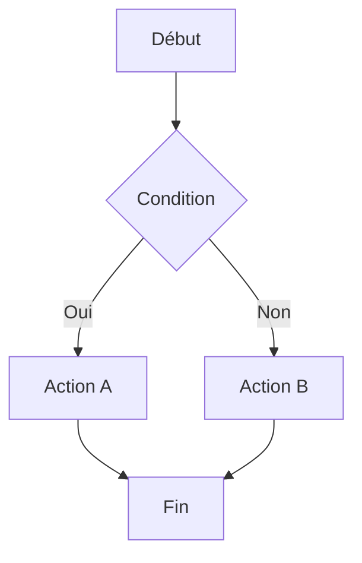
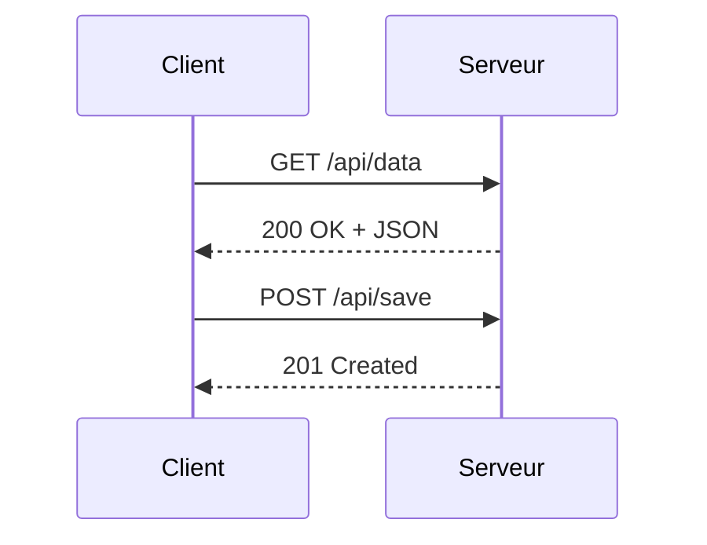
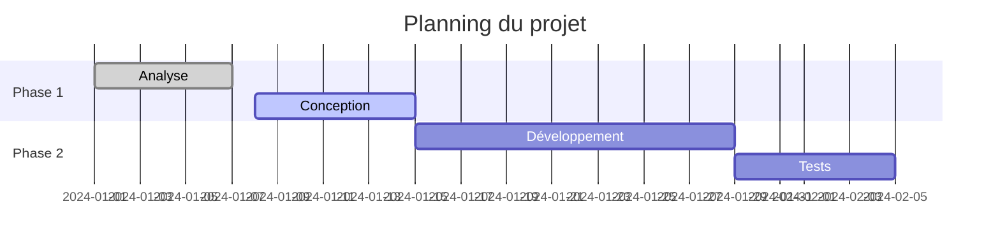

## Introduction {#intro}

**GitHub Flavored Markdown** (GFM) est la variante du Markdown utilisée par GitHub. Elle étend la syntaxe standard CommonMark avec des fonctionnalités propres à l'environnement GitHub : alertes visuelles, listes de tâches, références aux issues, diagrammes, et plus.

Ce guide couvre uniquement les **extensions GFM** — pour les bases du Markdown (titres, listes, liens, code…), consultez d'abord le [guide Markdown standard](/help/markdown/guide).

### Où s'applique le GFM ?

Le GFM est rendu automatiquement dans :

- Les fichiers `README.md`, `CONTRIBUTING.md` et autres `.md` du dépôt
- Les **issues**, **pull requests** et **discussions**
- Les **commentaires** de commit et de review
- Les **wikis** GitHub
- Les **releases** et leurs notes

## Alertes {#alerts}

Les alertes (aussi appelées _callouts_ ou _admonitions_) sont des blockquotes colorées avec une icône et un label. Elles permettent de mettre en évidence des informations importantes.

### Syntaxe

```md
> [!NOTE]
> Information utile à retenir, mais non bloquante.

> [!TIP]
> Conseil pratique pour aller plus loin ou travailler plus efficacement.

> [!IMPORTANT]
> Information critique à lire absolument pour que les choses fonctionnent.

> [!WARNING]
> Avertissement : risque d'erreur ou de comportement inattendu.

> [!CAUTION]
> Danger : action potentiellement destructrice ou irréversible.
```

### Rendu et couleurs

| Type           | Couleur | Usage typique                         |
| -------------- | ------- | ------------------------------------- |
| `[!NOTE]`      | Bleu    | Remarques, précisions                 |
| `[!TIP]`       | Vert    | Conseils, bonnes pratiques            |
| `[!IMPORTANT]` | Violet  | Prérequis, points critiques           |
| `[!WARNING]`   | Orange  | Comportements inattendus, précautions |
| `[!CAUTION]`   | Rouge   | Actions irréversibles, risques élevés |

### Contenu multi-lignes

```md
> [!NOTE]
> Cette alerte peut contenir plusieurs lignes.
>
> Elle supporte aussi du **Markdown** à l'intérieur : listes, `code`, liens, etc.
>
> - Premier point
> - Deuxième point
```

> **Attention** : Le `!` est obligatoire — `> [NOTE]` ne sera pas interprété comme une alerte mais comme une blockquote classique.

## Listes de tâches {#task-lists}

Les task lists permettent de créer des cases à cocher dans les issues, PRs et fichiers Markdown.

```md
- [x] Tâche terminée
- [ ] Tâche à faire
- [ ] Autre tâche en attente
    - [x] Sous-tâche terminée
    - [ ] Sous-tâche à faire
```

Dans les **issues et pull requests**, les cases sont interactives : on peut les cocher directement dans l'interface GitHub. Dans les fichiers `.md` du dépôt, elles sont simplement affichées.

### Usage courant

```md
## Checklist de release

- [x] Tests unitaires passés
- [x] Review approuvée
- [ ] Documentation mise à jour
- [ ] Tag de version créé
- [ ] Déployé en production
```

## Texte barré {#strikethrough}

GFM ajoute le support du texte barré avec deux tildes de chaque côté :

```md
~~Ce texte est barré~~

Le prix était ~~50€~~ maintenant **35€**.
```

Utile pour indiquer des informations obsolètes ou des éléments supprimés sans effacer le texte.

## Modèles de couleurs {#colors}

Dans les **issues, pull requests et discussions**, GitHub affiche un aperçu coloré inline lorsqu'une valeur de couleur est écrite entre backticks. Trois formats sont supportés :

```md
La couleur principale est `#0969DA`.

En RGB : `rgb(9, 105, 218)`.

En HSL : `hsl(212, 92%, 45%)`.
```

| Format  | Exemple                  |
| ------- | ------------------------ |
| **HEX** | `#0969DA`                |
| **RGB** | `rgb(9, 105, 218)`       |
| **HSL** | `hsl(212, 92%, 45%)`     |

> **Note** : L'aperçu couleur fonctionne uniquement dans les issues, PRs et discussions — pas dans les fichiers `.md` du dépôt.

## Tableaux {#tables}

Les tableaux sont une extension GFM (non incluse dans CommonMark de base) :

```md
| Nom     | Type     | Requis | Description        |
| ------- | -------- | :----: | ------------------ |
| `id`    | `string` |  Oui   | Identifiant unique |
| `name`  | `string` |  Oui   | Nom affiché        |
| `email` | `string` |  Non   | Adresse email      |
```

Les tableaux GFM supportent l'alignement des colonnes avec `:` dans la ligne de séparation (`:---` gauche, `:---:` centré, `---:` droite). Pour la syntaxe complète des tableaux, voir le [guide Markdown standard](/help/markdown/guide#tables).

## Liens automatiques {#autolinks}

GFM transforme automatiquement les URLs valides en liens cliquables, même sans la syntaxe `[texte](url)` :

```md
Visitez https://github.com pour plus d'informations.

Contactez-nous à support@exemple.com.
```

Sont reconnus automatiquement : `http://`, `https://`, `ftp://`, `mailto:` et les adresses email nues.

## Mentions {#mentions}

### Mentionner un utilisateur

```md
Merci @octocat pour ta contribution !

CC @equipe-frontend
```

Le nom d'utilisateur mentionné reçoit une notification et le lien pointe vers son profil GitHub.

### Mentionner une équipe

```md
Ping @organisation/equipe-backend pour review.
```

Tous les membres de l'équipe reçoivent une notification.

## Références aux issues et PR {#references}

GitHub transforme automatiquement certains patterns en liens vers des issues ou pull requests :

### Dans le même dépôt

```md
Voir l'issue #42.
Corrigé dans la PR #156.
Ferme #78 (ferme automatiquement l'issue lors du merge)
```

### Mots-clés de fermeture automatique

Utilisés dans le message de commit ou la description d'une PR, ces mots ferment automatiquement l'issue associée lors du merge :

```md
Fixes #42
Closes #42
Resolves #42
```

### Vers un autre dépôt

```md
Voir user/autre-repo#42 pour le contexte.
```

### Références aux commits

```md
Le commit abc1234 a introduit ce comportement.
```

Un hash SHA de 7 caractères ou plus est automatiquement transformé en lien vers le commit.

## Emoji {#emoji}

GitHub supporte les shortcodes emoji entre deux-points :

```md
Super travail ! :tada: :rocket:

:warning: Attention à ce point.

:white_check_mark: Terminé
:x: Non supporté
:construction: En cours
```

### Emoji courants en documentation

| Shortcode            | Emoji | Usage                    |
| -------------------- | ----- | ------------------------ |
| `:tada:`             | 🎉    | Célébration, release     |
| `:rocket:`           | 🚀    | Déploiement, performance |
| `:bug:`              | 🐛    | Bug, correction          |
| `:warning:`          | ⚠️    | Avertissement            |
| `:white_check_mark:` | ✅    | Validé, terminé          |
| `:x:`                | ❌    | Erreur, non supporté     |
| `:construction:`     | 🚧    | En cours, WIP            |
| `:book:`             | 📖    | Documentation            |

> La liste complète est disponible sur [emoji.gg](https://emoji.gg) ou [emojipedia.org](https://emojipedia.org).

## Notes de bas de page {#footnotes}

GFM supporte les footnotes pour ajouter des références sans surcharger le texte principal :

```md
Voici une affirmation avec une source[^1], et une autre[^source].

[^1]: Référence numérotée — peut être n'importe où dans le document.

[^source]: Les footnotes peuvent aussi avoir un nom textuel.
```

Les définitions `[^...]` sont automatiquement déplacées en bas de la page lors du rendu, avec un lien retour vers l'ancre d'origine.

## Diagrammes Mermaid {#mermaid}

GitHub rend nativement les blocs de code avec le langage `mermaid` en diagrammes SVG interactifs.

### Diagramme de flux

````md

````

### Diagramme de séquence

````md

````

### Diagramme de Gantt

````md

````

Les diagrammes Mermaid sont rendus uniquement sur GitHub — dans d'autres environnements (VS Code, etc.), un plugin ou extension est nécessaire.

## Sections repliables {#collapsible}

GFM accepte le HTML `<details>` et `<summary>` pour créer des sections repliables :

````md
<details>
<summary>Cliquez pour voir plus de détails</summary>

Le contenu ici est masqué par défaut et révélé au clic.

Vous pouvez y mettre du **Markdown** normal :

- Liste
- De points

```bash
echo "Même du code"
```
````

</details>
```

### Ouvert par défaut

```md
<details open>
<summary>Section visible par défaut</summary>

Ce contenu est affiché dès le chargement de la page.

</details>
```

> **Note** : Laissez une ligne vide après `<summary>...</summary>` pour que le Markdown à l'intérieur soit correctement interprété.

## Commentaires cachés {#comments}

Le HTML permet de masquer du contenu dans le rendu final. Le texte entre `<!--` et `-->` n'est visible que dans le source :

```md
<!-- TODO: compléter cette section avant la release -->

Voici le contenu visible de la page.

<!-- Note interne : ce paragraphe est temporaire -->
```

Utile pour :

- Laisser des **notes internes** sans les exposer dans le rendu
- **Désactiver temporairement** un bloc de contenu
- Ajouter des **TODO** ou rappels dans un fichier `.md`

> Le commentaire est invisible dans le rendu GitHub mais reste lisible dans le source — ne pas y mettre d'informations sensibles.

## Récapitulatif {#summary}

| Fonctionnalité          | Syntaxe                    | Standard? |
| ----------------------- | -------------------------- | :-------: |
| **Alertes**             | `> [!NOTE]`                | GFM only  |
| **Task lists**          | `- [x]` / `- [ ]`          | GFM only  |
| **Texte barré**         | `~~texte~~`                | GFM only  |
| **Tableaux**            | `\| col \| col \|`         | GFM only  |
| **Autolinks**           | URL nue → lien automatique | GFM only  |
| **Mentions**            | `@username`                |  GitHub   |
| **Références issues**   | `#42`, `Fixes #42`         |  GitHub   |
| **Emoji shortcodes**    | `:tada:`                   |  GitHub   |
| **Footnotes**           | `[^1]` + `[^1]: texte`     | GFM only  |
| **Mermaid**             | ` ```mermaid ` `           |  GitHub   |
| **Sections repliables** | `<details><summary>`       |   HTML    |
| **Modèles de couleurs** | `` `#rrggbb` ``, `` `rgb()` ``, `` `hsl()` `` | GitHub |
| **Commentaires cachés** | `<!-- texte -->`           |   HTML    |